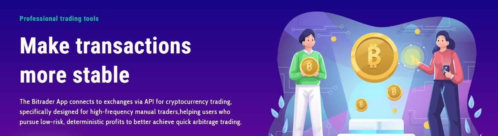

# Is FlashEX a Exchange?

<figure><figcaption></figcaption></figure>

## Is FlashEX an Exchange?

FlashEX is not an exchange.

FlashEX is an app that connects to exchanges through APIs, currently supporting the OKX exchange. After users configure their API (which they obtain from OKX) within the FlashEX App, they can use FlashEX to conduct cryptocurrency trades (currently limited to OKX USDT-based perpetual contract pairs).

The user's cryptocurrency assets remain in their exchange account, where they are fully managed by the user. FlashEX does not manage or hold any user cryptocurrency assets.
