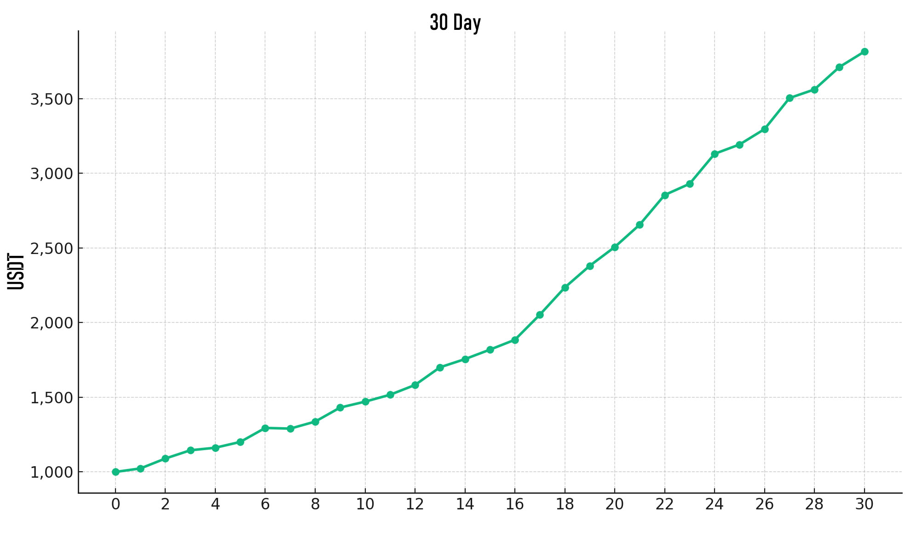

# The Value of FlashEX

<figure><figcaption></figcaption></figure>

## Modest Profits, Remarkable Compound Returns

**Earn Less, Win More**\
Low-percentage gains can achieve astonishing compounding results.\
While many chase extreme price swings, they forget: compounding doesn’t rely on doubling overnight, but on steady forward progress.

FlashEX advocates for a 0.5% gain per trade, combined with high-frequency execution and disciplined risk control—turning "earn a bit more today" into "earn much more in the long run".

✅ Every modest win is a seed of compounding\
✅ Every rational take-profit avoids liquidation\
✅ Just 3 winning trades per day for 30 days could double your capital

You don’t need to predict the market perfectly—just be a calm, consistent executor with a higher win rate.

📌 Compounding is not a miracle, but the result of doing one small thing right over time. FlashEX helps you do that one thing exceptionally well.

***

#### FlashEX Compound Growth Simulation

**Simulation Assumptions:**

* Daily expected return: **4.5%**
* **Assumption 1:** Each trade yields 0.5% profit using 3x leverage = 1.5% per trade\
  → 3 profitable trades/day = \~4.5% daily return
* **Assumption 2:** All other trades offset each other, leaving only the 3 stable gains
* Volatility simulation: ±2% drawdown
* Duration: 30 days
* Initial capital: **$1,000 USDT**

📅 After 30 days: **\~$3,545.69 USDT**\
💰 Total return: **$2,545.69 USDT**

**Small profits. Big impact.**

<figure><figcaption></figcaption></figure>

## This is the FlashEX philosophy: consistent small wins > occasional big wins.

It’s not explosive profit—but it’s sustainable, controllable, and repeatable.\
**Use discipline to secure your win rate, and time to accumulate results.**
