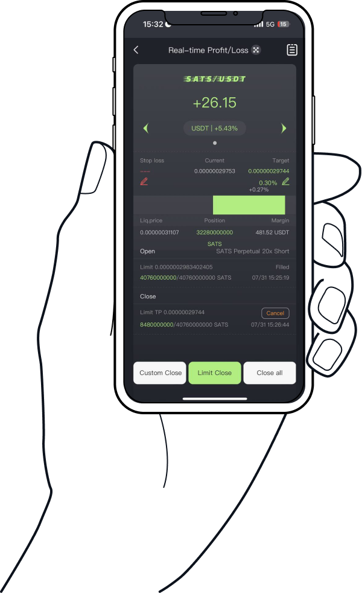

# Placing Orders & Monitoring Positions

## 🟩 **Placing an Order**

After selecting the **order direction** (Long or Short) and setting all relevant parameters, users can submit the order by tapping the **“Long”** or **“Short”** button.

Once the order is placed, FlashEx will automatically navigate to the **Real-Time PnL (Profit & Loss) Interface**, where users can track:

* Order execution status
* Real-time profit and loss of their open positions

***

## 🟦 **Monitoring Your Positions**

The **Real-Time PnL Interface** provides key trading and market information, helping users understand both their position and current market movements at a glance:

### **Core Information Displayed:**

* **Position Direction & Size:**\
  Shows whether the position is long or short, along with the number of contracts.
* **Real-Time PnL:**\
  Displays current unrealized profit or loss of the open position.
* **Entry Price vs. Market Price:**\
  Helps users compare their entry point to current market conditions.
* **Take-Profit, Stop-Loss, and Liquidation Prices:**\
  Clearly displays key risk control price levels.
* **Close Status & Profit Progress:**\
  Indicates whether the position has been closed and if the take-profit goal has been achieved.

***

### 🛠 **Actionable Features in the PnL Interface**

To enhance flexibility and control, FlashEx provides the following quick-action buttons:

* **Market Close:**\
  Instantly close the position at the best available market price. Useful for quick profit-taking, stop-loss actions, or exiting during high volatility.
* **Limit Close:**\
  Submit a limit close order based on the current market price.
* **Adjust Take-Profit Target:**\
  Modify the originally set profit percentage at any time.\
  Ideal for adapting to changing market conditions or updating your risk/reward expectations.
* **Add Margin:**\
  Manually increase your margin to improve position safety and reduce liquidation risk.\
  Useful in volatile markets or when managing leveraged trades.
* **Manual Close:**\
  Close positions manually instead of relying solely on automatic take-profit.\
  Suitable for partial closing, scaling out, or implementing customized exit strategies.

<figure><figcaption></figcaption></figure>

***

## ⚡ FlashEx Signature Feature — Smart Auto Take-Profit

Every order placed on FlashEx is more than just an entry — it immediately initiates an **automated take-profit process**.

Once the position is opened:

* The system **automatically generates a corresponding take-profit order**
* No extra steps are required
* You stay in control while the system handles execution

***

### 🕒 Instant Execution When Price Reaches Target

Whether the market moves up or down, as soon as your predefined profit target is reached, FlashEx responds in **milliseconds** to close your trade — no need to monitor the screen constantly.

***

### 💥 Profit Protection in Volatile Markets

During fast-moving conditions, FlashEx’s **auto-delegation engine** helps lock in profits and mitigate risks, allowing you to:

> **“Set once, secure profits fast.”**

***

## ⚠️ Risk Management Advisory – You Control, We Assist

FlashEx provides an efficient and user-friendly order placement experience with built-in automation.\
However, as in any trading environment, markets can be volatile and unpredictable.

To help manage risk effectively, FlashEx offers:

* **Limit Close:**\
  Close positions gradually at your target price for better control.
* **Market Close:**\
  Instantly exit trades to minimize losses or capitalize on sudden changes.

⚠️ Please Note:\
FlashEx is a **trading assistant**, not a financial advisor or autonomous strategy provider.\
**You are solely responsible for your own trading decisions and risk exposure.**\
Use FlashEx to increase efficiency, but always trade based on your risk tolerance and strategy.

***

**FlashEx — Trade with more control, respond faster, and let “Set Once, Lock Profit” become your new norm.**
